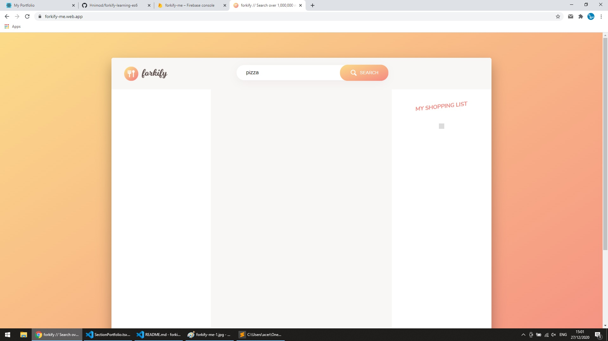
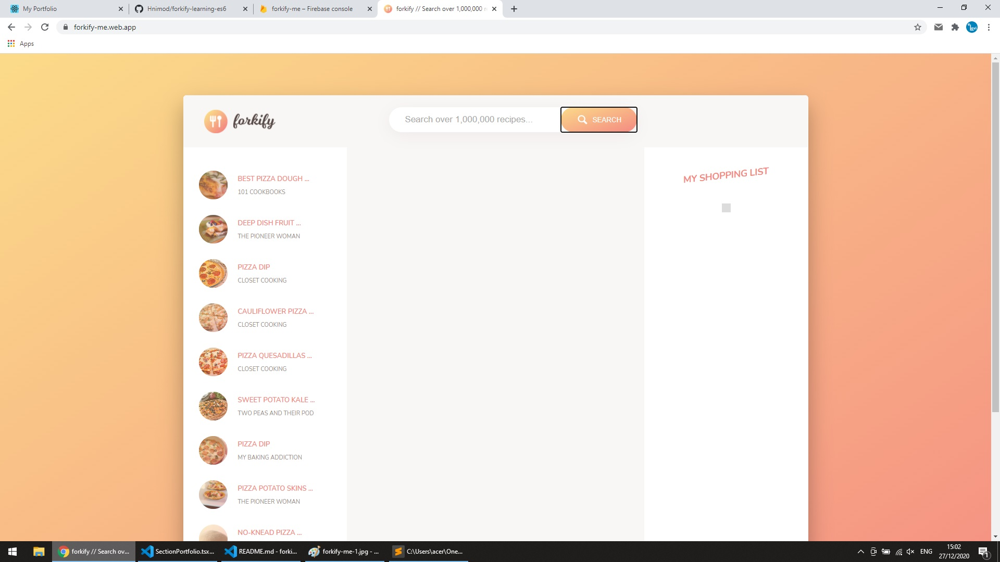
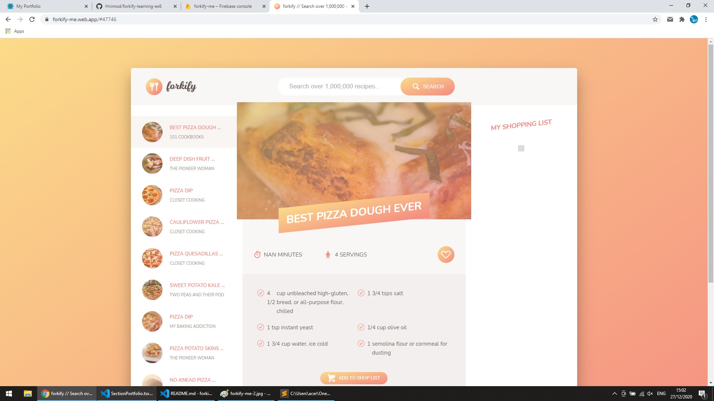
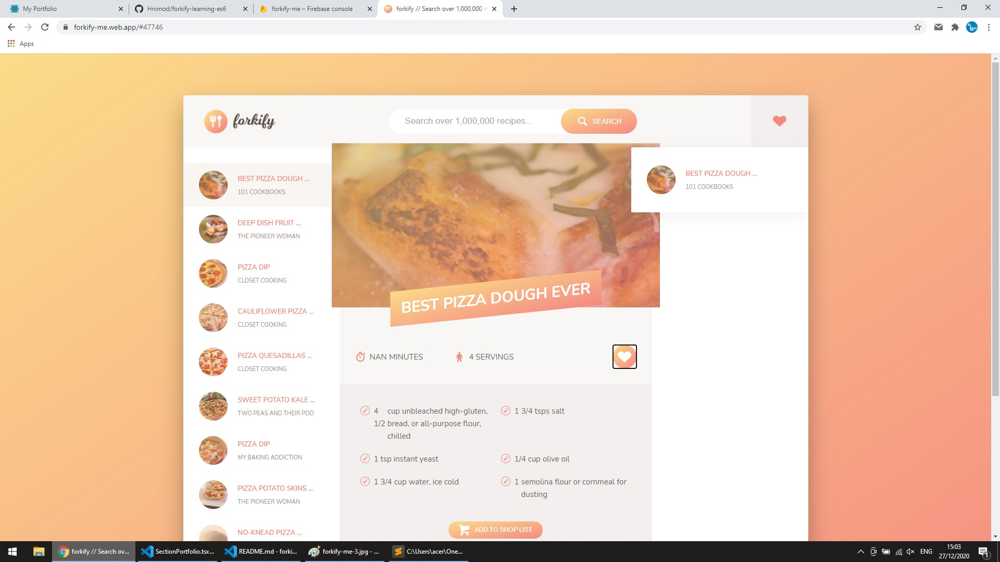
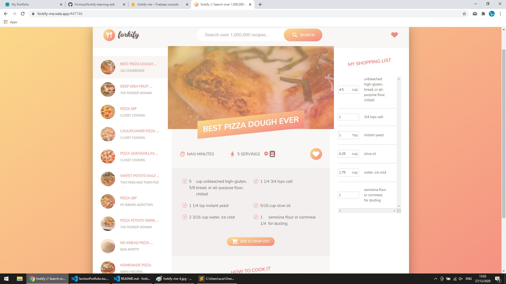

# Forkify

A cooking recipes website using vanilla Javascript ES6 features, basic Webpack configuration, and Sass.

https://forkify-me.web.app/

 

# Features

- Fetch dishes from user input.
- Load recipe and ingredients upon chosen dish.
- User can like dishes. Like list will be saved upon refresh. 
- Ingredients will update depends on number of servings

 

## Screenshots

## 

## 

## 

## 

## 